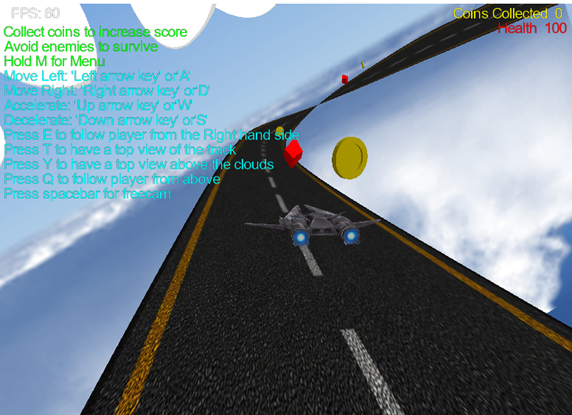

# Sky-Racer

SkyRacer is an exciting game developed in C++ using OpenGL, where players control a character moving along a dynamic track, collecting coins while navigating through challenging obstacles. The game incorporates manually implemented shading and lighting techniques to enhance the visual experience.

## Features

- **Coin Collection**: Collect coins scattered along the track to earn points and increase your score.
- **Obstacles**: Encounter various obstacles that challenge your reflexes and navigation skills.
- **Manual Shading and Lighting**: Experience immersive visuals with manually implemented shading and lighting effects.
- **Responsive Controls**: Precisely control your character's movement with responsive left and right controls.

## Controls

- **Left Arrow Key**: Move the character to the left.
- **Right Arrow Key**: Move the character to the right.

## Screenshots

