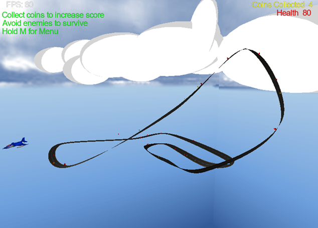
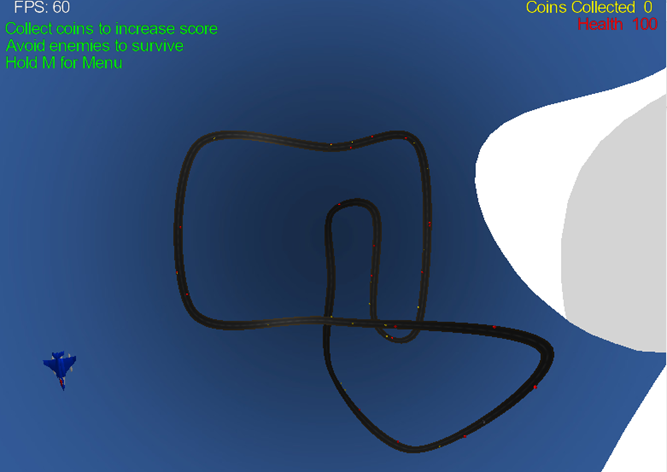

# Sky-Racer

SkyRacer is a project developed in C++ using OpenGL, where players control a plane moving along a static track, collecting coins while navigating through obstacles.

## Features

- **Coin Collection**: Collect coins scattered along the track to earn points and increase your score.
- **Obstacles**: Red cube with its points stretched along the y-axis, randomly generated on either the middle, left or right of the track
- **Responsive Controls**: Repsonsive controls for moving the player and changing the camera angles

# Controls

This document outlines the controls for the game.

| Key(s)                  | Function                                              |
|-------------------------|-------------------------------------------------------|
| Left arrow or "A"       | Move player left                                      |
| Right arrow or "D"      | Move player right                                     |
| Up arrow or "W"         | Increase player speed                                 |
| Down arrow or "S"       | Decrease player speed                                 |
| "M"                     | Display game controls                                 |
| "Q"                     | Set camera view above player, following around track  |
| "E"                     | Set camera view to right side of player               |
| "T"                     | Set camera view to top view above the track           |
| "Y"                     | Set camera view to top view above the clouds          |
| Spacebar                | Set camera to free cam mode                           |

## Screenshots

